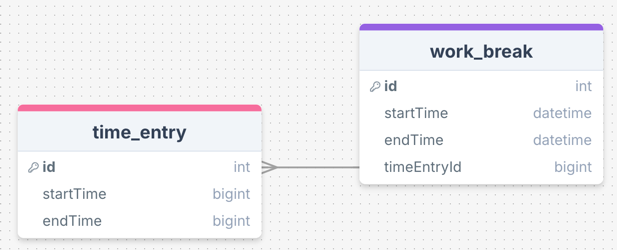

# workinax

A work clock in & out project

## Modèle de données



## Getting Started

This project is a starting point for a Flutter application.

A few resources t<o get you started if this is your first Flutter project:

- [Lab: Write your first Flutter app](https://docs.flutter.dev/get-started/codelab)
- [Cookbook: Useful Flutter samples](https://docs.flutter.dev/cookbook)

For help getting started with Flutter development, view the
[online documentation](https://docs.flutter.dev/), which offers tutorials,
samples, guidance on mobile development, and a full API reference.

## Test coverage

__Generate & open coverage__

```shell script
$ flutter test --coverage
$ lcov --remove coverage/lcov.info 'lib/*/*.g.dart' 'lib/core/constants/*.dart' 'lib/theme/*.dart' -o coverage/lcov.info
$ genhtml coverage/lcov.info -o coverage/html
$ open coverage/html/index.html
```

## Backlog

- Add day off requests
- Statistic page filtered by month & week
